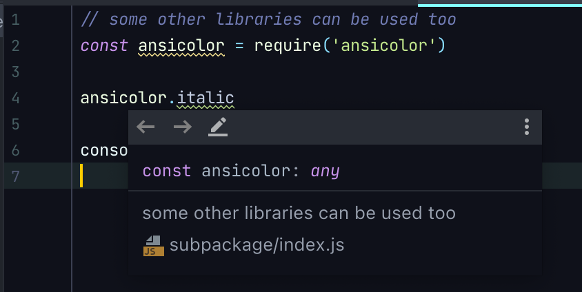
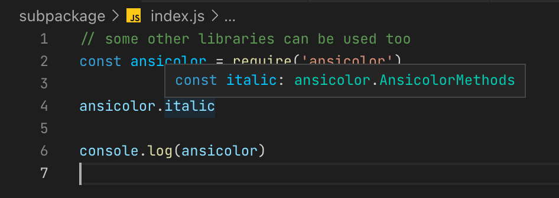

# webstorm-bug-poc

### Steps to reproduce:
1. Open this folder in WebStorm
2. Run `npm install`
3. Open `subpackage/index.js`

### Expected behavior
`ansicolor` dependency is indexed, types are imported, autocompletion works

### Actual behavior
`ansicolor` dependency is not indexed, types are not imported

It works in VSCode:

